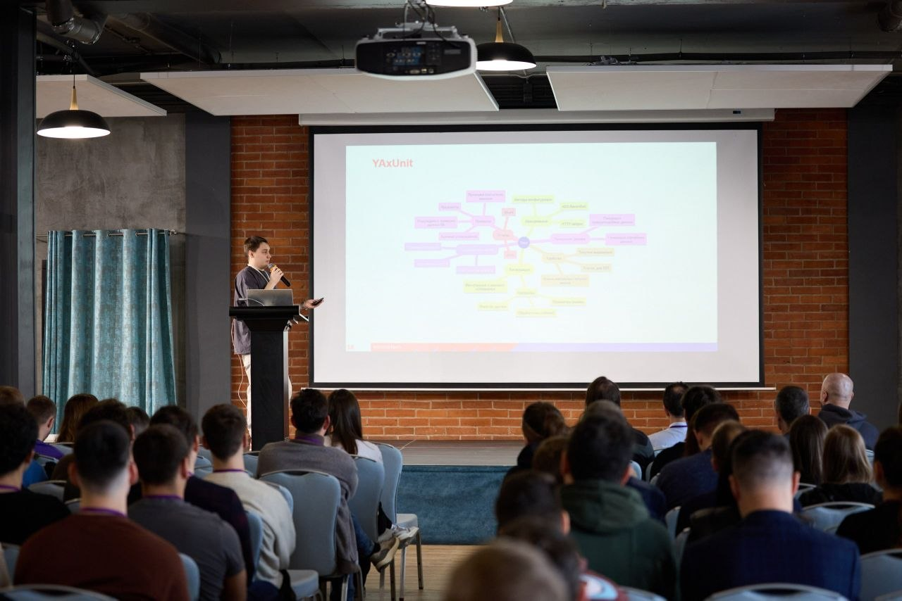
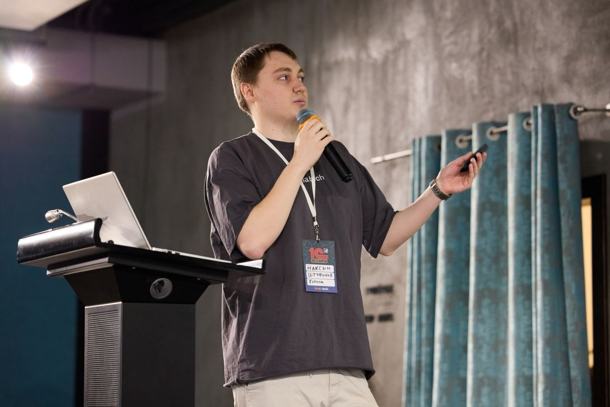

# Юнит-тесты в 1С: паттерны проектирования

Материалы доклада Максима Штифонова о проектировании устойчивых юнит-тестов на платформе 1С.

## Материалы

- [Презентация PowerPoint](unit-testing-1c.pptx) с заметками докладчика
- [Презентация в PDF](unit-testing-1c.pdf) в формате страниц заметок: слайд и пояснение на одной странице
- [Пояснения к каждому слайду](speaker-notes.md) со скриншотами для чтения непосредственно на GitHub

## О докладе

Доклад посвящён практическому применению юнит-тестов в проектах 1С. В презентации рассматриваются классическая и лондонская школы тестирования, различие между наблюдаемым поведением и деталями реализации, а также паттерны и антипаттерны тестового кода.

Отдельная часть посвящена YAxUnit, подготовке тестовых данных, использованию моков, запуску проверок в CI и постепенному внедрению тестирования в команде.

Основные темы:

- что считать юнит-тестом в 1С;
- изоляция тестов и использование моков;
- проверка поведения вместо деталей реализации;
- паттерн AAA и распространённые антипаттерны;
- управление тестовыми и случайными данными;
- хранение тестов, CI и организация тестовых баз.

## Выступление на Meetup 1C. Весна 2026

Доклад был представлен 21 марта 2026 года на конференции [Meetup 1C. Весна 2026](https://dns-tech.timepad.ru/event/3828473/), организованной ООО «ДНС Технологии» во Владивостоке.

  
  

Выступление Максима Штифонова на Meetup 1C. Весна 2026 во Владивостоке

## Использование ИИ при подготовке текста

Исходные идеи, примеры и выводы подготовлены автором. Часть текста пояснений была автоматически отредактирована с помощью ИИ, чтобы сделать материал более связным и удобным для чтения в текстовом формате. Итоговую редакцию и проверку выполнил автор.

## Автор

Штифонов Максим Александрович

## Лицензия и сторонние материалы

Авторские материалы распространяются по лицензии [CC BY-NC-ND 4.0](https://creativecommons.org/licenses/by-nc-nd/4.0/deed.ru). Она разрешает некоммерческое распространение оригинальной версии с указанием автора, но не разрешает распространение изменённых версий.

Товарные знаки, логотипы, сторонние изображения, цитаты, фотографии и снимки интерфейсов не входят в указанную лицензию и принадлежат их соответствующим правообладателям. Подробности приведены в файлах [LICENSE.md](LICENSE.md) и [THIRD_PARTY_NOTICES.md](THIRD_PARTY_NOTICES.md).

Репозиторий не является официальным материалом фирмы «1С», KoronaTech, BIA Technologies, ООО «ДНС Технологии» или других упомянутых организаций.
