# Пояснения к презентации «Юнит-тесты в 1С: паттерны проектирования»

Этот документ содержит пояснения автора к каждому слайду. Его можно читать вместе с презентацией или как самостоятельный конспект доклада.

Исходные идеи, примеры и выводы подготовлены автором. Часть текста была автоматически отредактирована с помощью ИИ, чтобы сделать пояснения более связными и удобными для чтения. Итоговую редакцию и проверку выполнил автор.

## Слайд 1. Юнит-тесты в 1С: паттерны проектирования

Добрый день, коллеги! Меня зовут Максим Штифонов, я ведущий разработчик в KoronaTech. Сегодня я хочу поговорить о юнит-тестах в 1С и о паттернах проектирования, которые помогают писать тесты без лишних проблем.

## Слайд 2. План доклада

Сначала мы разберёмся, что считать юнит-тестом и зачем нужна изоляция. Затем посмотрим на классическую и лондонскую школы тестирования, обсудим различие между поведением и деталями реализации.

После этого перейдём к паттернам и антипаттернам на примерах 1С, а в конце поговорим о внедрении тестов в реальный процесс разработки: Git, CI/CD, тестовые базы и работу с командой. По ходу доклада я также покажу несколько практических приёмов и лайфхаков, которые пригодились нам в работе.

## Слайд 3. КТО Я?

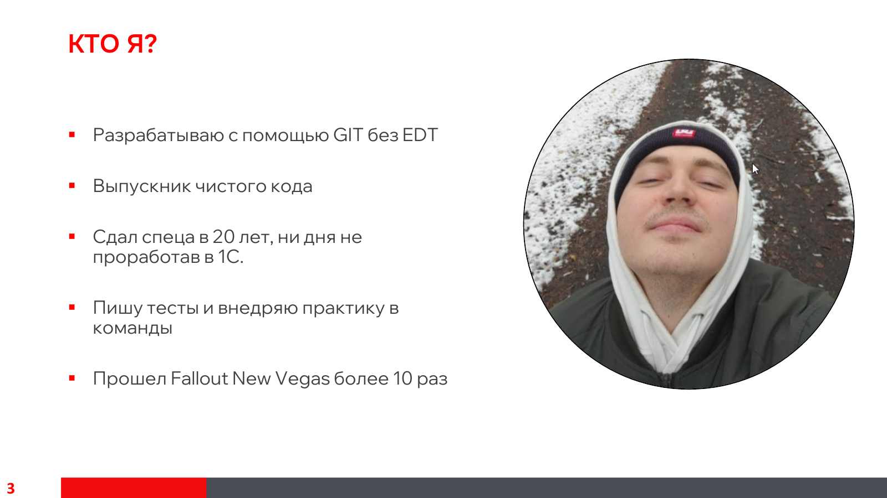

Немного обо мне. С 1С я знаком ещё со школы, а в двадцать лет сдал экзамен «1С:Специалист», хотя тогда ещё не работал разработчиком официально и был самоучкой без реальных проектов. Сейчас я ведущий разработчик в KoronaTech и работаю над финансовыми продуктами на платформе 1С.

В последние годы я занимаюсь тестированием и всем, что с ним связано. Ну а Fallout: New Vegas - это просто легендарная игра, на которую всегда найдётся ещё несколько сотен часов.

## Слайд 4. КТО МЫ?

Мы разрабатываем финансовые продукты, в частности решения для займов. На слайде показано, как нас видят внешние сервисы: для них это просто один блок с надписью «1С». Вот так просто - 1С.

Внутри всё сложнее: формирование клиентского портфеля, закрытие дня, расчёт графиков, отправка отчётности и множество связанных процессов (рисунок со схемой взаимодействия был удален ДИБом). Каждая ошибка в такой системе стоит бизнесу копеечку, а иногда и совсем не копеечку.

Миллиарды для нас - это не абстрактные цифры, а ежедневный денежный оборот. Поэтому возможность быстро проверить бизнес-логику после изменений стала для нас особенно важной.

## Слайд 5. Состояние тестирования

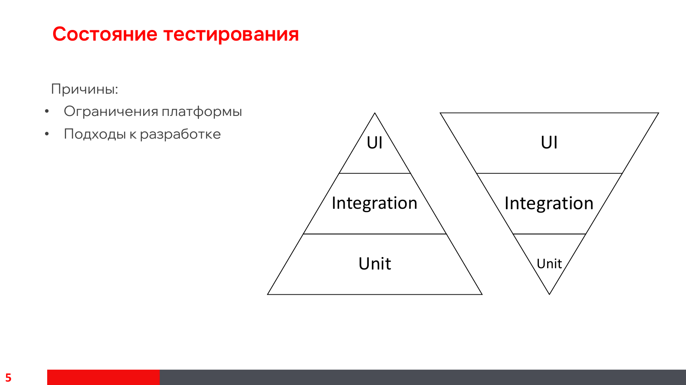

В тестировании часто используют метафору пирамиды: в основании находится много быстрых юнит-тестов, выше - меньше интеграционных, а на вершине - немного UI- и сквозных тестов.

В проектах 1С эта пирамида нередко перевёрнута: основная нагрузка приходится на ручные и высокоуровневые проверки, а юнит-тестов мало. Причины можно разделить на две группы.

Первая - привычные подходы к разработке. В конфигурациях 1С часто встречается высокая связанность компонентов: бизнес-логика тесно переплетена с метаданными, данными информационной базы и элементами интерфейса.

Вторая группа - технические особенности платформы. Отдельный компонент не всегда можно просто запустить в полностью изолированном окружении. Встроенные возможности подмены зависимостей ограничены, поэтому приходится использовать расширения, тестовые данные и инструменты тестового движка. Дополнительная проблема - размытые границы ответственности модулей.

Смысл слайда не в том, что UI-тесты плохи. Нам нужны разные уровни проверок, но как можно больше локальных правил выгодно проверять быстрыми тестами.

## Слайд 6. Что такое юнит тест

Несмотря на множество определений, у юнит-теста есть три основные характеристики. Он проверяет одну законченную единицу поведения, выполняется быстро и изолирован от других тестов.

Под юнитом я имею в виду не обязательно один метод или модуль. Это может быть небольшой сценарий поведения, понятный с точки зрения предметной области. Изоляция означает, что тесты не оставляют друг другу данные и не зависят от порядка запуска. Контролируемая среда может достигаться по-разному: подготовкой собственных данных, откатом изменений или заменой отдельных зависимостей заглушками. Заглушки полезны, но не являются обязательным признаком каждого юнит-теста. А скорость позволяет выполнять проверки постоянно - локально и в CI.

## Слайд 7. YAxUnit

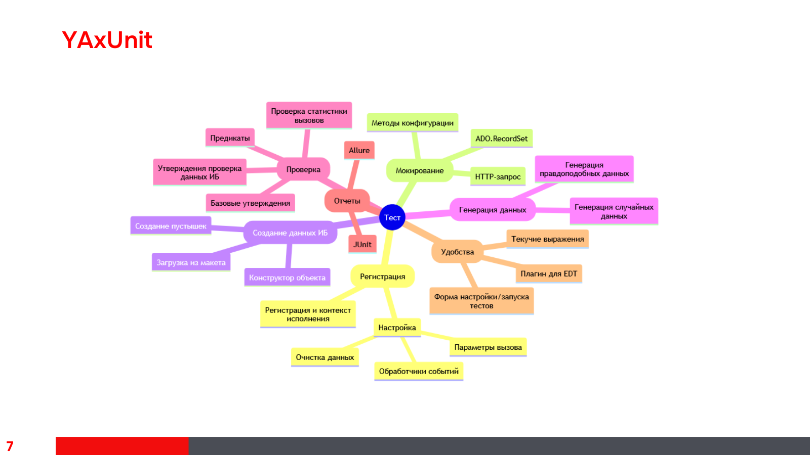

Все дальнейшие примеры будут показаны на YAxUnit - движке модульного тестирования решений на платформе 1С. Он предоставляет регистрацию сценариев, утверждения, подготовку и удаление тестовых данных, мокирование, параметризацию и отчёты для CI.

При этом YAxUnit - не единственный инструмент в экосистеме 1С. Ранее и сейчас используется xUnitFor1C, а так же продукты семейства Vanessa.

В нашей практике мы выбрали YAxUnit: он активно развивается, поддерживается сообществом и уже используется во многих проектах. Мне особенно нравится его текучий интерфейс - цепочки вызовов читаются почти как описание требования.

## Слайд 8. Подходы в изоляции

Вернёмся к изоляции. В двух школах тестирования этот термин понимается по-разному. Классическая, или детройтская, школа в первую очередь изолирует тесты друг от друга. Лондонская школа изолирует тестируемый код от его изменяемых зависимостей и чаще использует моки.

Мы не будем разбирать все различия школ. Посмотрим на главный разделитель, сравним два варианта одного теста и обсудим, что практичнее в типичной разработке на 1С.

## Слайд 9. Изоляция по классике(детроит)

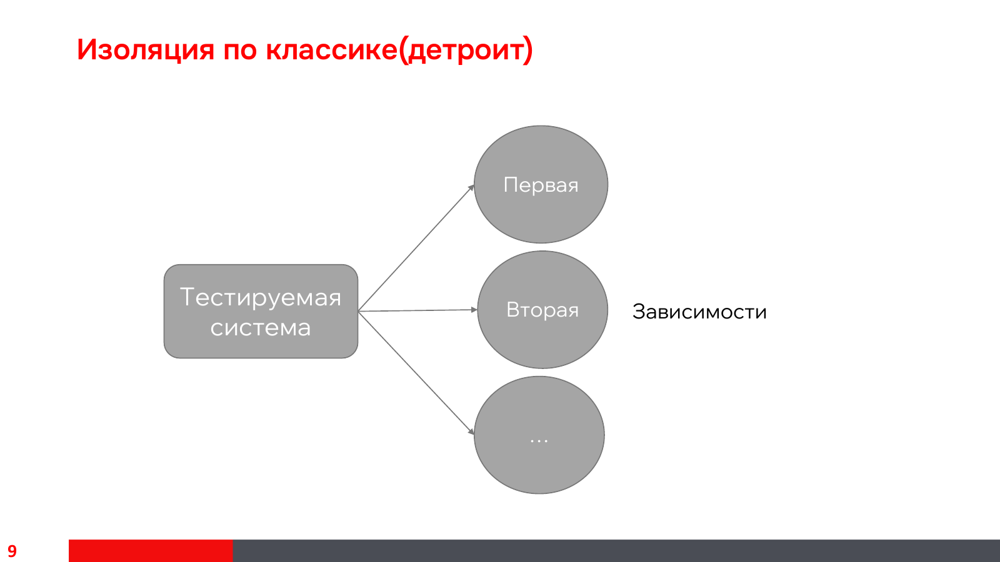

Классическая школа требует, чтобы тесты не влияли друг на друга. При этом внутри одного теста могут работать несколько реальных компонентов, если вместе они реализуют одно проверяемое поведение.

На рисунке тестируемая система зависит от двух объектов. Это могут быть модули, объекты 1С или обычные структуры данных. Их не нужно автоматически заменять моками. Важно, чтобы тест самостоятельно готовил состояние, оставался быстрым и после выполнения не мешал другим тестам.

## Слайд 10. Изоляция по-лондонски

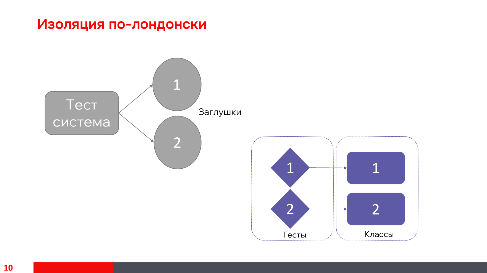

Лондонская школа изолирует тестируемую систему от её изменяемых коллабораторов. Реальные зависимости заменяются заглушками или моками, поведение которых заранее настраивается в тесте.

Это удобно, когда зависимость медленная, нестабильная или обращается к внешнему ресурсу. Но из этого не следует, что один тест обязан проверять только один класс. Граница теста всё равно определяется поведением. Риск появляется, когда тест начинает проверять каждый внутренний вызов и тем самым связывается с реализацией.

## Слайд 11. Пример изоляции по школам

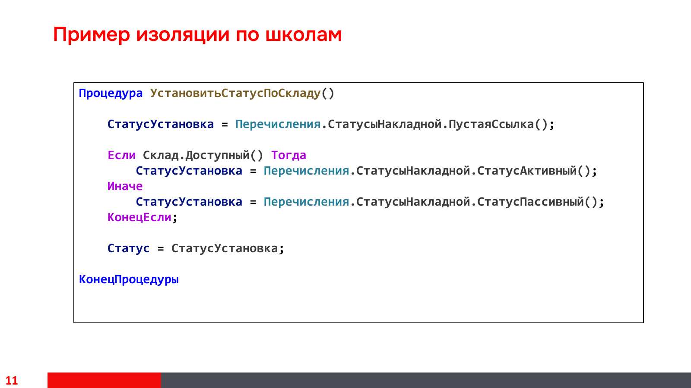

Чтобы сравнить школы, посмотрим на простой пример. В модуле объекта накладной есть процедура «УстановитьСтатусПоСкладу». Она проверяет доступность склада и устанавливает документу активный или неактивный статус.

Нас интересует решение, которое принимает накладная: если склад доступен, статус должен стать активным. В следующих двух тестах ожидаемый результат будет одинаковым, но зависимость от склада мы подготовим по-разному.

## Слайд 12. Изоляция по классике

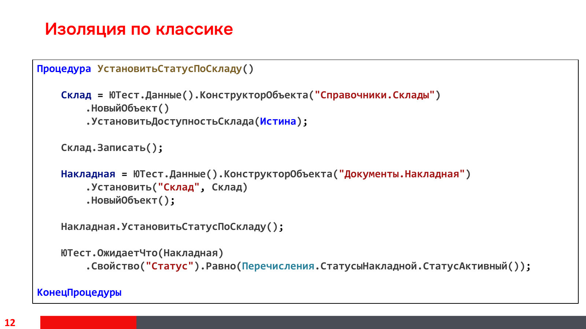

Начнём с классического варианта. Мы создаём настоящий склад, настраиваем его функцией «УстановитьДоступностьСклада», записываем, помещаем ссылку в накладную, выполняем тестируемый метод и проверяем, что статус стал активным.

Теперь посчитаем зависимости. Склад - настоящий объект, а не мок. Поскольку мы записываем его, появляется зависимость от информационной базы. Кроме того, могут существовать невидимые зависимости: обязательные реквизиты, обработчики записи и другие правила конфигурации.

## Слайд 13. Изоляция по лондонски

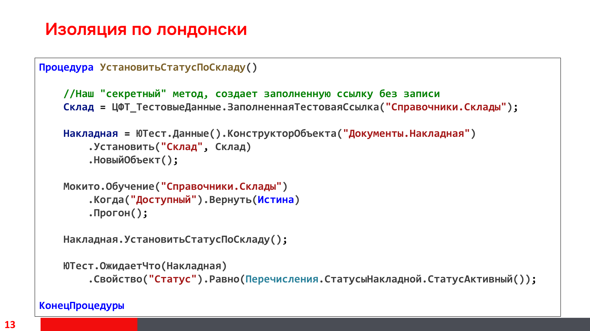

Теперь немного натянем сову на глобус и попробуем максимально изолировать накладную от склада. Запись реального склада заменяем созданием подходящей ссылки, а вызов метода доступности - настроенным мок-объектом, который возвращает «Истина».

В результате тесту требуется меньше реальных данных, но он начинает знать, какой метод вызывается внутри накладной. Важно: показанный на слайде «секретный метод» создания ссылки - это проектный технический приём, а не стандартный API YAxUnit. Такой способ стоит использовать осознанно и только там, где он действительно упрощает проверку.

## Слайд 14. Вывод по школам тестирования

Как мы уже отмечали, эти два подхода фундаментально различаются и требуют вдумчивого применения. Однако в экосистеме 1С мы часто имеем дело с сильно связанными конфигурациями. Множество объектов взаимосвязаны и активно используют данные и состояние друг друга.

В таких условиях классическая школа тестирования, на мой взгляд, становится оптимальным выбором. Она предоставляет инструменты для создания контролируемого и предсказуемого окружения, что позволяет надёжно тестировать сложные, тесно связанные объекты конфигурации.

## Слайд 15. Имплементация - конкретная техническая реализация функциональности в коде.

Перед написанием теста - а ещё лучше до написания основного кода - полезно понять, что именно делает метод и что является его наблюдаемым результатом. Мы хотим проверять поведение системы, результат выполнения и значимые взаимодействия компонентов, а не конкретный способ реализации.

## Слайд 16. Поведение

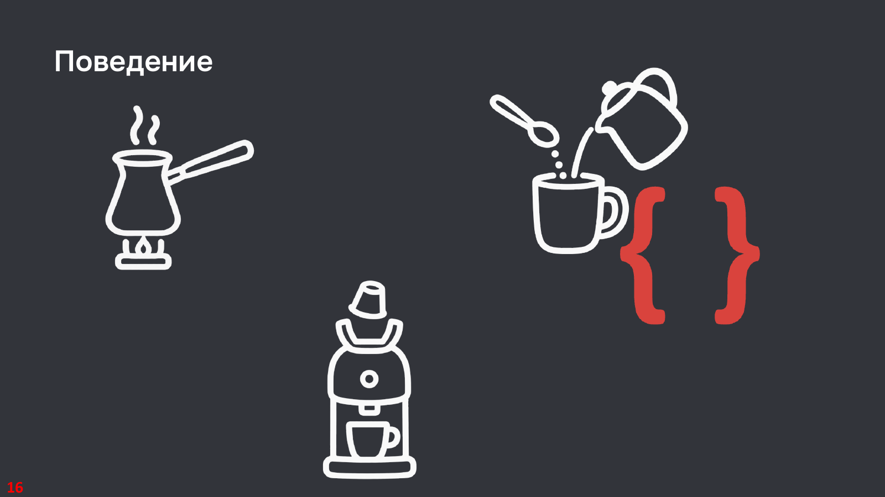

Простая аналогия - приготовление кофе. Поведение одно: получить чашку горячего кофе. Но реализация может быть разной: засыпать молотый кофе в турку и нагреть его; положить капсулу в кофемашину и нажать кнопку; залить кипятком растворимый кофе.

Если результат и публичный контракт не изменились, тест не должен ломаться только потому, что внутри появился другой способ приготовления.

## Слайд 17. Детали имплементации

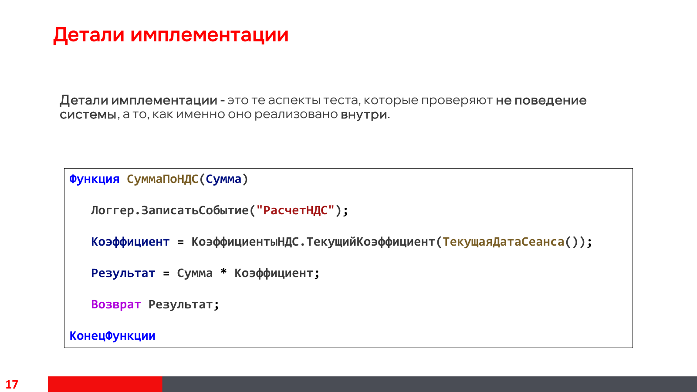

Детали имплементации - это проверки не поведения системы, а того, как именно оно реализовано внутри. Они фиксируют внутренние решения, которые сами по себе не входят в контракт поведения.

Это происходит, когда тест знает о внутреннем устройстве кода и проверяет:

1. Какие именно методы вызываются.

2. В каком порядке они вызываются.

3. Какие внутренние переменные используются.

4. Какую структуру данных имеет тестируемый объект.

В примере такими деталями могут быть логгер, поиск коэффициента и даже конкретный способ умножения суммы на коэффициент. Итоговая рассчитанная сумма - это уже наблюдаемый результат.

Логирование тоже может стать поведением, если журнал или событие являются обязательным внешним результатом для аудита или интеграции. Граница зависит от требований к системе. Тесты на детали становятся хрупкими, требуют постоянных изменений при рефакторинге и слишком много знают о внутреннем устройстве кода.

## Слайд 18. Проверка деталей

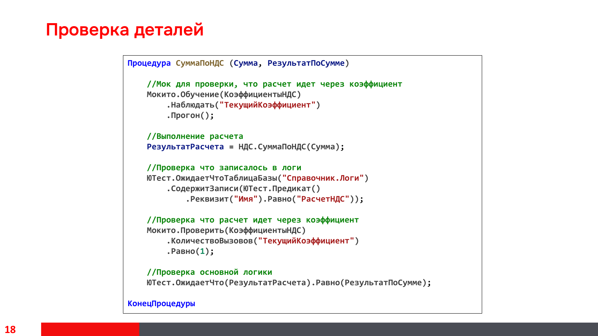

В этом тесте мы проверяем сразу несколько внутренних действий: запись события в логгер, обращение к модулю коэффициентов и только затем итоговую сумму НДС.

Если завтра расчёт перепишут, уберут логирование или заменят способ получения коэффициента, тест сломается, даже если сумма останется правильной. Это ложное срабатывание: поведение системы не изменилось, а тест требует переделки. Чем больше таких проверок, тем дороже безопасный рефакторинг.

## Слайд 19. Проверка поведения, результата, взаимодействия

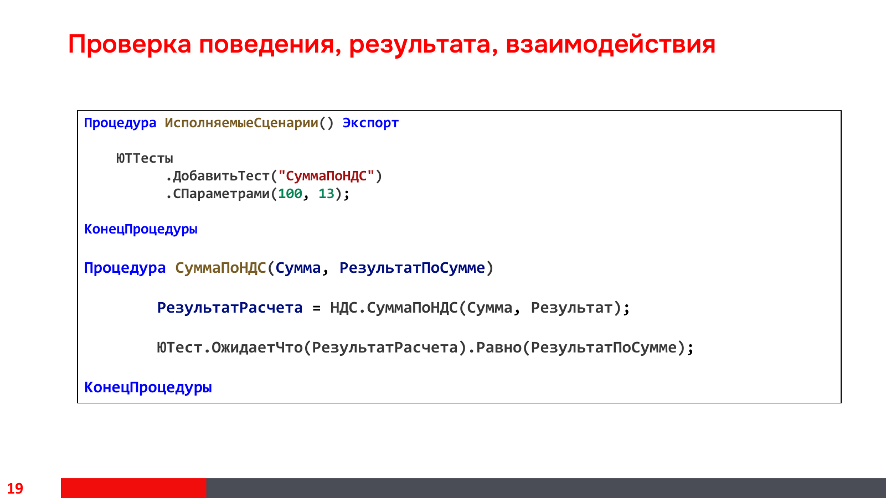

Исправленный вариант получился заметно проще: выполняем расчёт и сравниваем итоговую сумму с ожидаемой. Формально здесь проверяются выходные данные метода - это один из способов наблюдать его поведение. Я дальше буду для простоты называть такую проверку проверкой поведения.

При этом всегда нужно учитывать границу конкретного модуля: что именно он обязан делать и какой результат видит его потребитель. То, что для одного компонента является внутренней деталью, для другого может быть публичным контрактом.

В доработках типовых объектов иногда приходится отдельно контролировать точку расширения или перехват, потому что нам важно сохранить саму «врезку» в чужой код. Такой тест нужно честно воспринимать как более связанный с реализацией.

## Слайд 20. Паттерны и антипаттерны

Мы увидели несколько причин хрупкости тестов. Теперь перейдём к практическим шаблонам, которые помогают сделать сценарии понятнее, и к антипаттернам, по которым можно быстро заметить проблему в структуре теста.

## Слайд 21. Паттерн AAA (Arrange-Act-Assert)

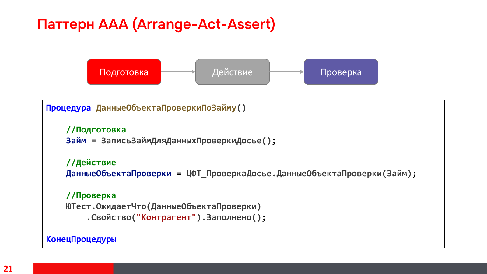

Паттерн AAA делит тест на три части: Arrange - подготовка исходных условий, Act - одно основное действие, Assert - проверка результата. Такая структура делает тесты проще для чтения, написания и сопровождения, а также помогает удерживать фокус на одном конкретном поведении.

На слайде в блоке подготовки создаётся тестовый заём, в блоке действия вызывается проверяемый метод, а в блоке проверки полученная коллекция сравнивается с ожиданием. По такой структуре сразу видно, какой сценарий задан, где находится основное действие и какое поведение мы защищаем.

## Слайд 22. Антипаттерн Множественные секции

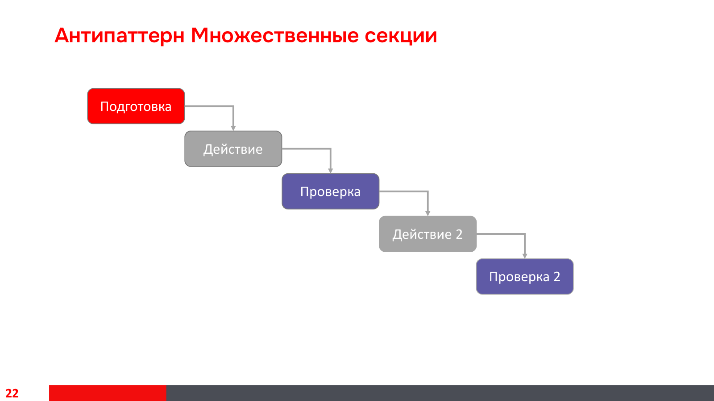

Если внутри одного теста повторяются блоки подготовки, действия и проверки, тест, скорее всего, охватывает несколько единиц поведения. Его становится труднее читать и отлаживать.

Обычно решение простое: разделить сценарий на несколько самостоятельных тестов. Редкое исключение возможно в интеграционном тесте, когда подготовка внешнего состояния очень дорога, но для обычного юнит-теста несколько действий - хороший сигнал остановиться и пересмотреть границу.

## Слайд 23. Пример множественных секций

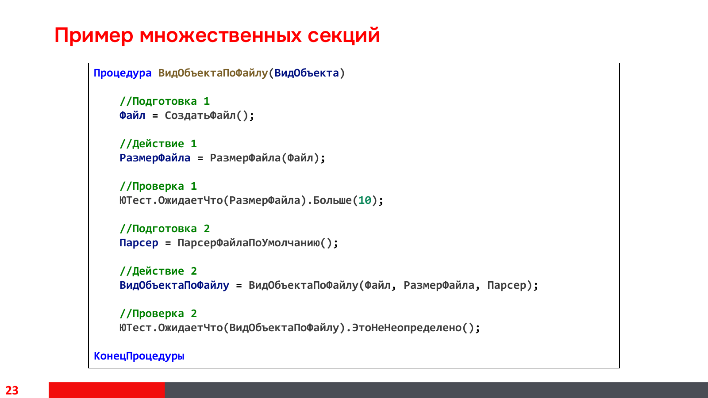

В примере сначала проверяется размер файла, а затем тот же сценарий продолжает работу: запускается парсер и проверяется вид объекта. Уже при чтении заметно, что здесь две самостоятельные причины падения. Почему это плохо?

Во-первых, снижается читаемость: тест перестаёт отвечать на простой вопрос «Что именно он проверяет?».

Во-вторых, усложняется отладка: падение поздней проверки не сразу показывает, на каком действии появилась ошибка.

В-третьих, вместо одного поведения тест начинает проверять целую цепочку.

Лучше сделать два теста: один - на формирование файла нужного размера, второй - на определение вида объекта парсером. Тогда название каждого теста будет точно описывать ожидание, а при ошибке мы сразу поймём, какое поведение нарушено.

## Слайд 24. Антипаттерн "Если"

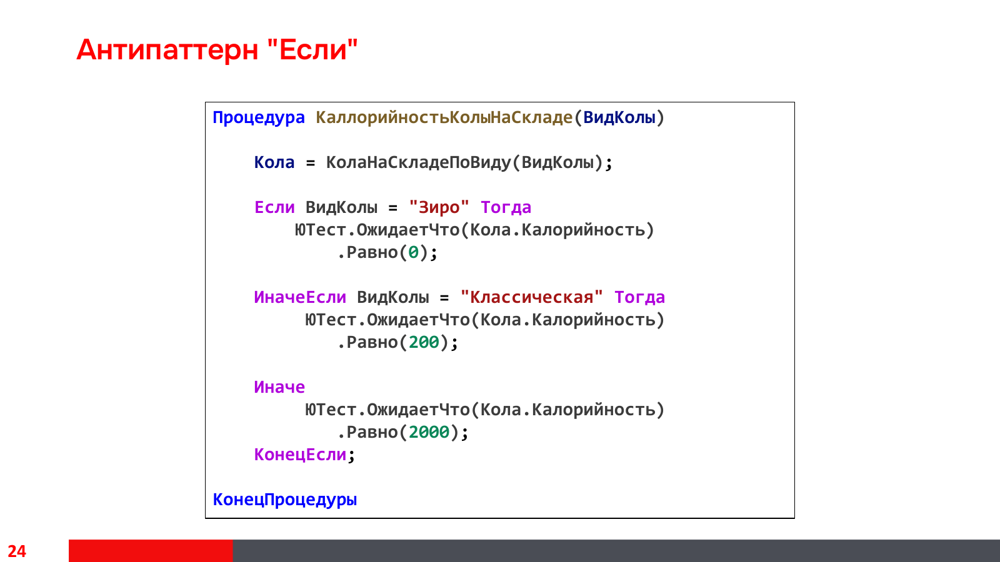

Условный оператор внутри тестового метода - ещё один тревожный признак. Тест должен быть линейным сценарием с заранее известным ожидаемым результатом. Если ожидание выбирается через «Если», то в одном методе спрятано несколько сценариев.

В примере калорийность определяется по виду колы прямо внутри теста. При добавлении нового варианта придётся менять код проверки. Лучше вынести варианты во входные параметры и выполнить один и тот же сценарий для каждого набора данных.

Обратите внимание на блок «Иначе». Что именно должно находиться в этой ветке? Сейчас тест ожидает калорийность 2000 для любого вида колы, который не является «Зиро» или «Классической». Но это ожидание ничем не обосновано.

Если завтра появится кола с лаймом, она автоматически попадёт в «Иначе». Тест либо проверит её по неверному правилу, либо нам придётся снова открывать тестовый метод и добавлять новую ветку. Кроме того, внутри теста мы фактически повторяем часть бизнес-логики: самостоятельно определяем ожидаемый результат по виду колы.

В хорошем тесте ожидаемый результат известен заранее и не вычисляется с помощью условий. Поэтому в данном тестовом методе ветка «Иначе» вообще не нужна.

## Слайд 25. Исправление "Если"

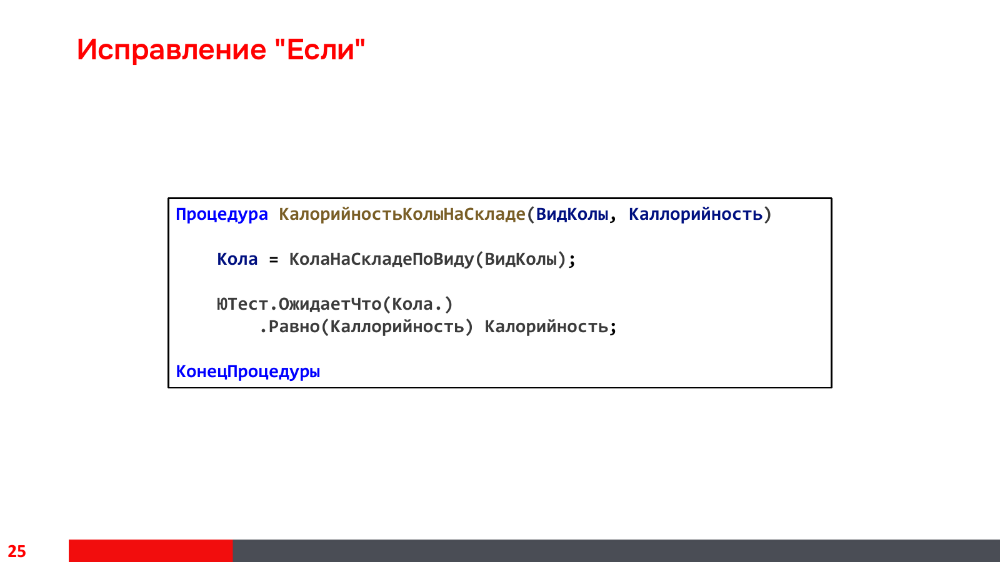

В исправленном варианте вид колы и ожидаемая калорийность передаются как параметры. Сам тест больше не ветвится: он получает готовый сценарий, выполняет действие и сравнивает результат.

При появлении колы с лаймом мы добавим ещё один набор параметров, не меняя тело теста. Эти параметры можно перечислить при регистрации теста или сформировать снаружи отдельной функцией.

## Слайд 26. Сильная связанность при изменении

Когда вы меняете бизнес-логику или структуру данных в одном месте программы, вам приходится вносить правки в десятки, казалось бы, не связанных тестов. Это прямое следствие того, что тесты слишком сильно завязаны на конкретную реализацию, а не на публичный контракт тестируемого метода или объекта.

Цена поддержки тестов становится очень высокой. Вместо того чтобы изменить один тест для одного модуля, вы тратите время на исправление множества хрупких тестов.

Именно это называется сильной связанностью при изменении.

## Слайд 27. Сильная связанность при изменении

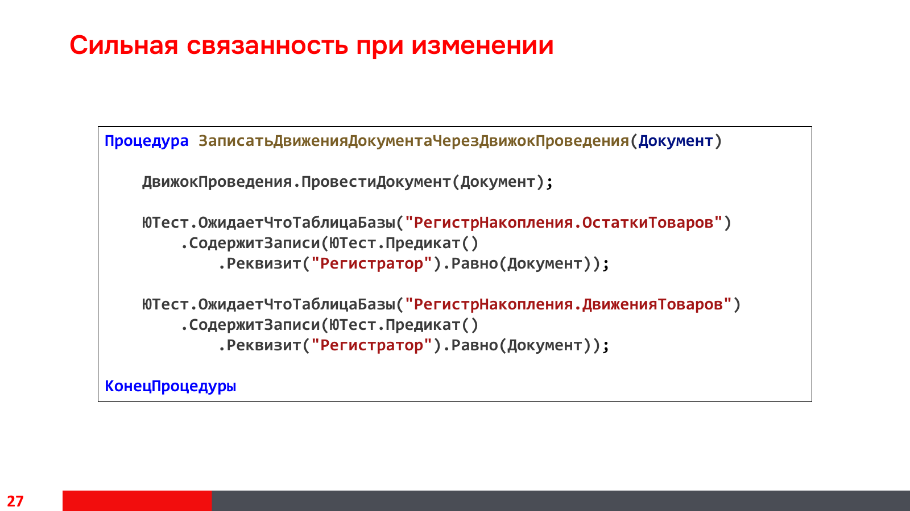

Мы хотим проверить запись движений документа через «ДвижокПроведения». Структура движений хранится в документе, а правила их записи и порядок выполнения находятся в отдельном движке.

В первом варианте тест не только запускает движок, но и проверяет внутреннюю схему хранения: появились ли записи в регистрах «ОстаткиТоваров» и «ДвиженияТоваров», а также ссылаются ли они на документ как на регистратора. Если один регистр заменят другим, тест сломается, даже когда публичный результат движка останется прежним.

Этот тест жёстко завязан на внутреннюю реализацию проведения документа. Он проверяет не то, что система делает - у документа записались движения, - а то, как она это делает: в какие именно регистры создаются движения.

## Слайд 28. Исправленная сильная связанность при изменении

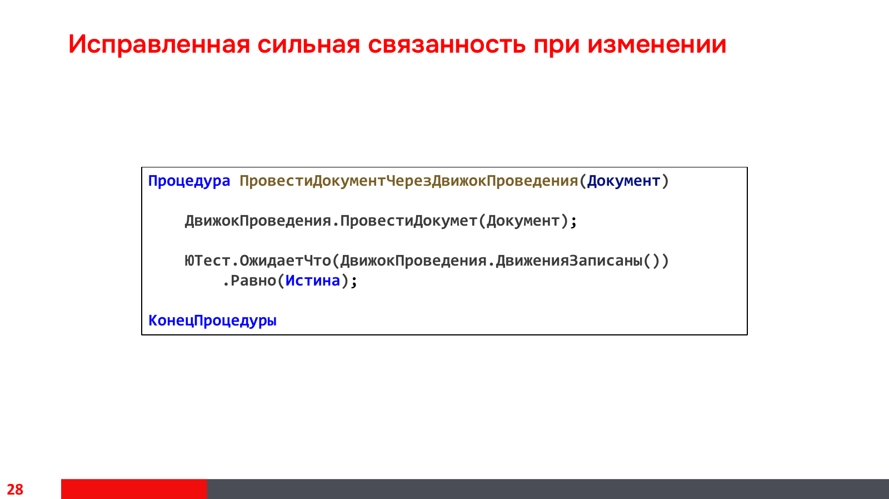

Исправленный тест проверяет контракт движка: операция завершилась успешно.

Он больше не зависит от конкретных регистров и продолжит работать после внутреннего рефакторинга, если обещанное поведение сохранится. Если бизнес-требование требует проверить сами движения, такую проверку нужно оставить отдельно - уже на подходящем интеграционном уровне.

Здесь важен архитектурный вывод. Я проверяю не обработку проведения каждого документа по отдельности, а выделенный «ДвижокПроведения». Этот простой тест стал возможен потому, что код изначально проектировался с понятным результатом и отдельной зоной ответственности.

Когда начинаешь писать тесты, меняется сам подход к программированию: появляются явные контракты, вместо прямого обращения к глобальному состоянию - управляемые точки доступа, а зависимости становятся заметнее. Поэтому юнит-тесты писать просто, если основной код изначально написан с учётом тестируемости.

## Слайд 29. Сильная связанность при выполнении

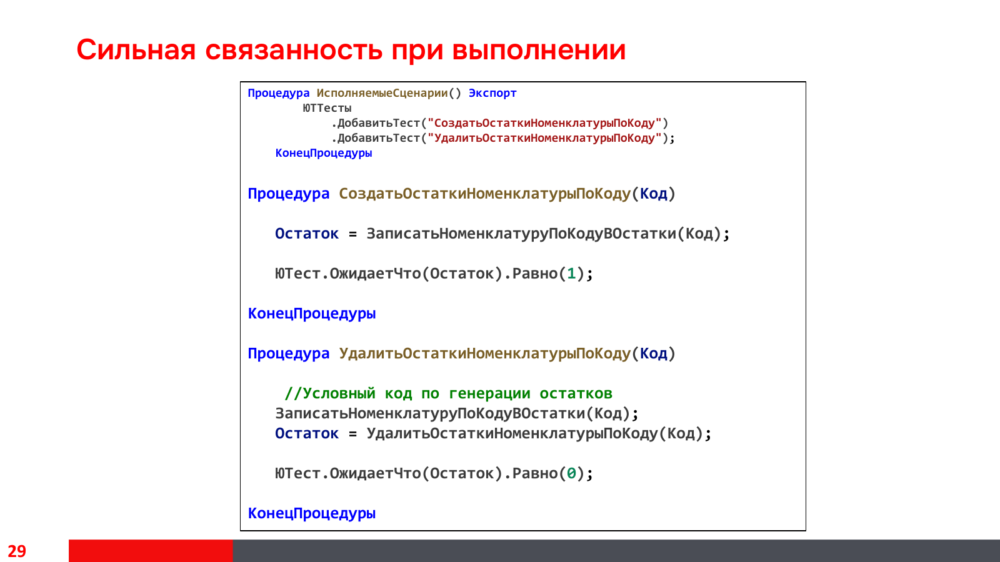

Сильная связанность при выполнении возникает, когда тесты используют общее состояние и влияют друг на друга.

Тест А проходит только после теста Б, который подготовил или оставил данные. Отдельно запустить такой тест для отладки уже нельзя, а результат общего прогона зависит от порядка.

В примере зарегистрированы тесты «СоздатьОстаткиНоменклатурыПоКоду» и «УдалитьОстаткиНоменклатурыПоКоду». Первый создаёт номенклатуру и остаток, но не очищает их. Второй работает с тем же кодом, добавляет собственные данные, удаляет остаток и ожидает ноль. Однако в базе может остаться запись первого теста, поэтому фактический результат не совпадает с ожиданием.

Каждый тест должен самостоятельно создавать уникальное окружение и не рассчитывать на следы другого теста.

## Слайд 30. Исправленная сильная связанность при выполнении

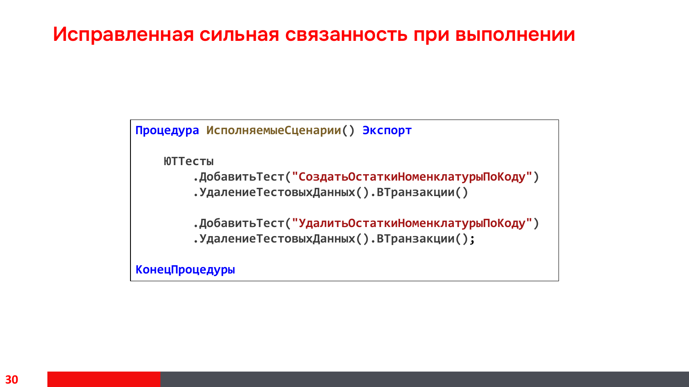

Для исправления каждый тест должен получить собственное состояние. В YAxUnit можно запускать поддерживаемые серверные тесты в транзакции и откатывать изменения после выполнения.

Для объектов, созданных через «ЮТест.Данные()», можно включить автоматическое удаление. Эти механизмы не взаимозаменяемы и не покрывают всё автоматически.

Транзакции не применяются к клиентским тестам и могут конфликтовать с кодом, который управляет своими транзакциями. Автоудаление не удалит данные, созданные напрямую или внутри продуктового кода.

## Слайд 31. Случайные данные как случайный выстрел

Использование случайных данных в юнит-тестах - это спорная практика, которая может свести на нет их главные преимущества. Самая критичная проблема - недетерминизм, ведущий к нестабильным тестам. Такой тест может случайно проходить или падать без изменений в коде, заставляя разработчика тратить время на поиск несуществующих ошибок.

Случайные данные также затрудняют воспроизведение ошибки. Если тест упал на сборке, мы можем не знать, какие именно данные привели к падению, и не суметь воспроизвести эту ситуацию локально.

Наконец, такие тесты плохо документируют код. Их цель размывается: вместо того чтобы быть живым примером использования системы, они превращаются в чёрный ящик.

Но мы живём в реальном мире - в мире 1С. Подготовить вручную миллионы наборов тестовых данных практически невозможно.

Поэтому полностью избегать случайных данных часто нецелесообразно с точки зрения трудозатрат. Ключевой момент заключается не в полном отказе от них, а в осознанном применении и управлении случайностью.

Основная задача - отделить случайность, используемую для удобства генерации тестовых данных, от случайности самих тестовых сценариев.

## Слайд 32. Пример ошибочных случайных данных

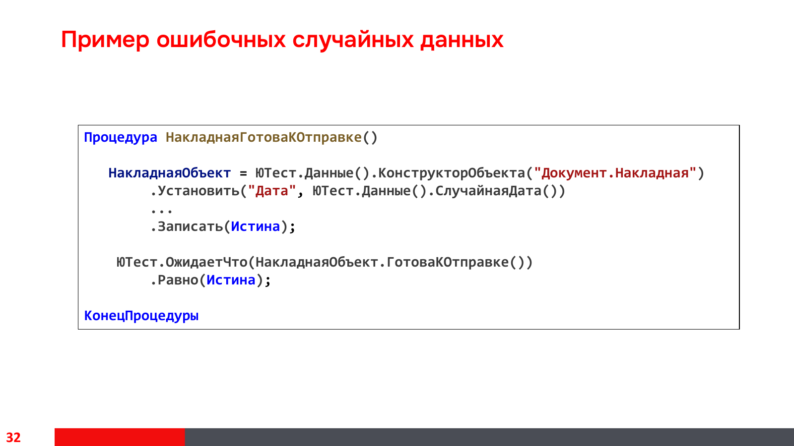

Рассмотрим тест готовности накладной к отправке. Мы создаём объект, как-то его настраиваем, присваиваем документу случайную дату, записываем и ожидаем, что метод «ГотоваКОтправке()» вернёт «Истина».

Дата не относится к заявленному поведению, но является значимым реквизитом документа и способна помешать записи. А что, если запрещено создавать документы прошлым или будущим периодом? Что, если случайная дата попадёт в закрытый период? Настройки базы тоже могут отличаться.

Кроме того, «СлучайнаяДата()» без границ использует очень широкий диапазон. В итоге тест периодически падает ещё на записи - по причине, не связанной с готовностью накладной к отправке.

## Слайд 33. Исправление ошибочных случайных данных

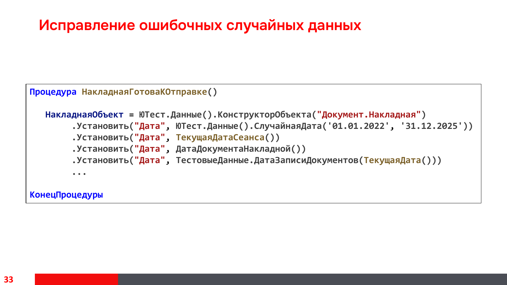

Решений несколько, и показанные строки являются альтернативами. Можно ограничить случайную дату безопасным диапазоном, использовать текущую дату сеанса или вынести выбор в функцию с предметным названием - например, «ДатаДокументаНакладной()».

Так значение проксируется через отдельный уровень абстракции, и на него можно централизованно повлиять позднее.

Иногда техническую зависимость можно отключить настройкой базы, функциональной опцией или константой перед тестом. Но всегда нужно оценивать трудозатраты: если для небольшой проверки требуется подготовить миллион настроек, возможно, лучше выбрать более простой вариант, другой уровень теста или изменить дизайн кода.

## Слайд 34. Внедрение

Под конец я хочу коротко рассказать о личном опыте внедрения тестов. Написать первый тест несложно. Гораздо труднее сделать так, чтобы тестирование стало обычной частью командной разработки, а не личной инициативой одного человека.

## Слайд 35. Хранение

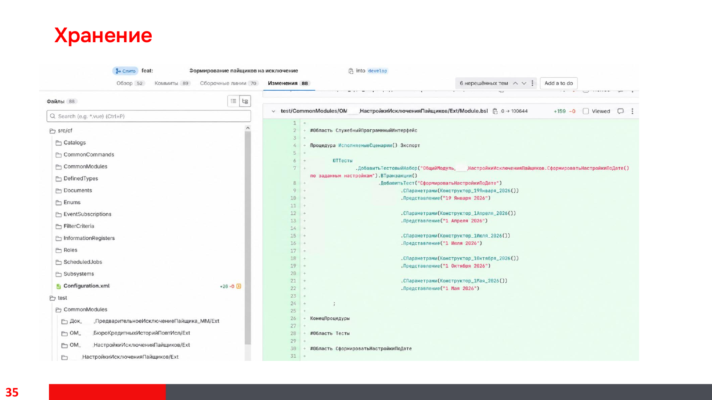

Во-первых, нужен воспроизводимый способ хранить тесты вместе с кодом. У нас это GitLab. На слайде видно, что в рамках одной задачи изменяется основная функциональность и одновременно добавляются тесты. Благодаря этому код и его проверки проходят ревью вместе, а история изменений остаётся связанной.

Если Git в конкретной команде пока не используется, тестовое расширение можно версионировать средствами принятого процесса, в том числе через штатное хранилище конфигурации. Конкретный инструмент может быть другим; важен сам принцип: тесты должны храниться и поставляться вместе с функциональностью, которую защищают.

## Слайд 36. Проверки

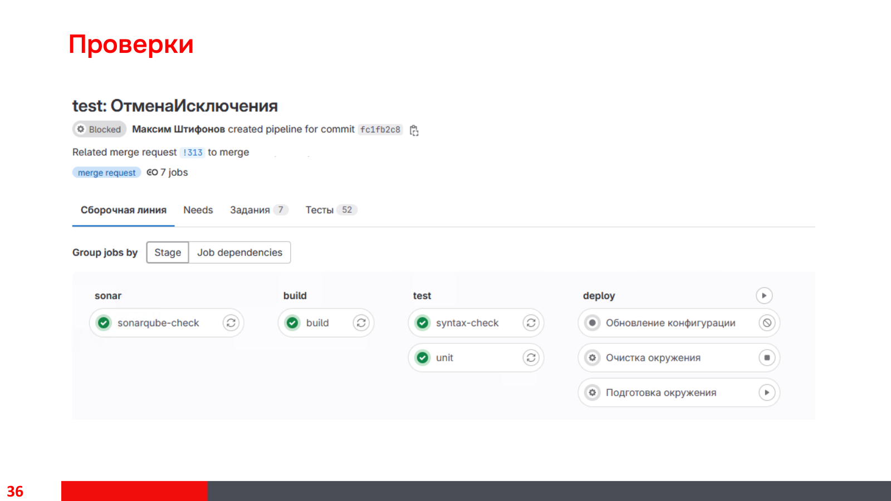

Далее - автоматические проверки. На скриншоте показан GitLab Pipeline, который запускается при изменениях в репозитории. Это конвейер CI: один этап отвечает за модульные тесты, другие - за сборку основной конфигурации и тестового расширения, синтаксическую проверку и дополнительные проверки качества. Так каждый новый тест, добавленный в рамках задачи, автоматически попадает в общий процесс проверки.

## Слайд 37. Базы

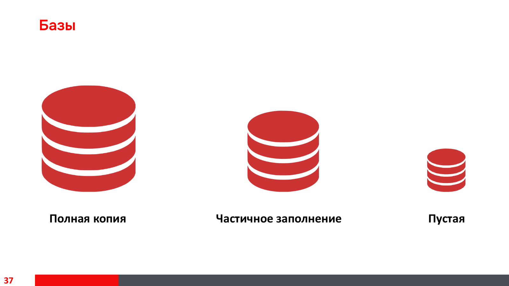

Сразу стоит договориться, какой будет тестовая база. Полная копия обычно является самым неудобным вариантом: она большая, содержит лишние данные и создаёт скрытые зависимости между тестами.

На практике мне ближе частично заполненная база: в ней есть только основные настройки и стабильные инфраструктурные данные, а всё, что относится к конкретному сценарию, создаёт сам тест. Особенно удобно, если базовое состояние воспроизводимо формируется обработчиками обновления.

Пустая база максимально прозрачна, но требует серьёзных усилий по созданию данных и автоматической инициализации. Это сложно и дорого, хотя даёт высокий уровень контроля.

## Слайд 38. Люди…

И наконец, люди - обычно самый сложный этап внедрения. Нужно не только убедить команду писать тесты, но и постепенно менять основной код: уменьшать связанность, выделять контракты и управлять зависимостями. Это легко воспринимается как дополнительная работа.

Лучше начинать с небольшого пилота и показывать практическую пользу: безопасный рефакторинг, воспроизводимые ошибки и меньше ручной регрессии. Когда-нибудь я отдельно расскажу, как нам удалось изменить взгляд команды на разработку, но это уже тема другого доклада.

## Слайд 39. Источники

В завершение хочу порекомендовать основные источники. Книга Владимира Хорикова «Принципы юнит-тестирования» - доступное руководство, которое помогает понять качество тестов, изоляцию, устойчивость к рефакторингу и разумное применение моков.

Документация и сообщество YAxUnit показывают, как реализовать эти идеи на платформе 1С. Именно благодаря работе сообщества всё, о чём мы говорили сегодня, можно применять на практике.

## Слайд 40. Подытожим

Подведём итог. Начать писать тесты в 1С технически несложно: можно взять один модуль и один важный сценарий. Но устойчивость набора зависит от архитектуры и привычек, которые мы закладываем с первых тестов.

Тестируемый код обычно имеет более ясные границы, меньше скрытых зависимостей и понятнее выраженный контракт. А хорошие тесты дают уверенность при изменениях, защищают от регрессий и служат живыми примерами поведения системы.

Делайте тесты правильно, делайте тесты как я - и обязательно делайте их лучше меня.

## Слайд 41. Вопросы

Спасибо за внимание! Готов ответить на ваши вопросы.
